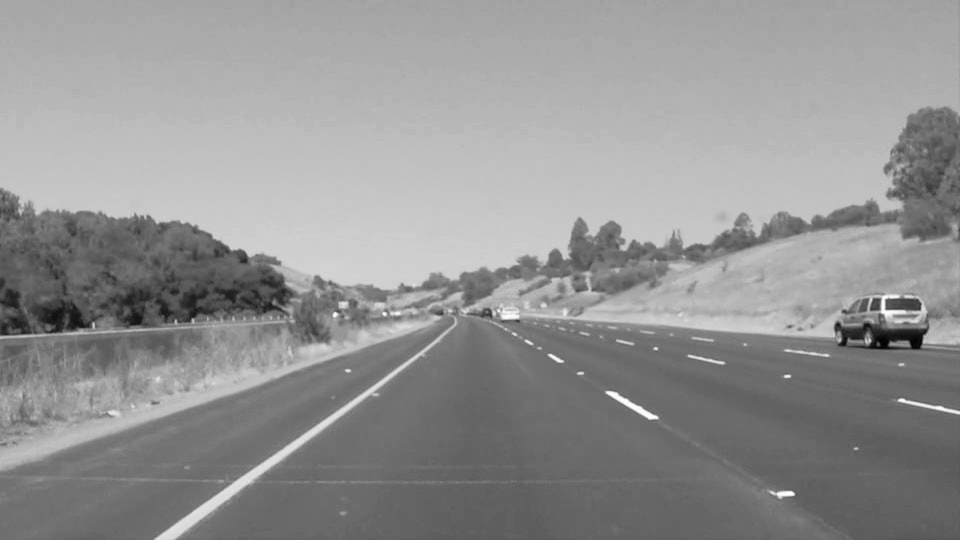
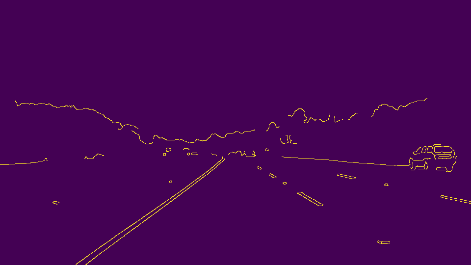
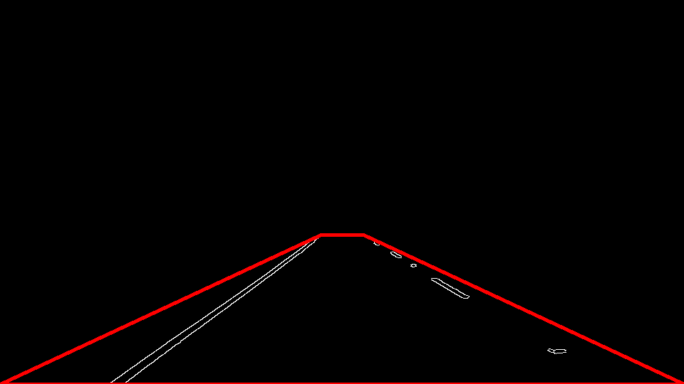
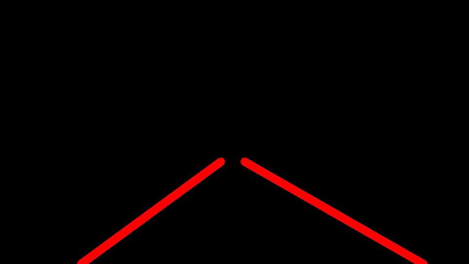
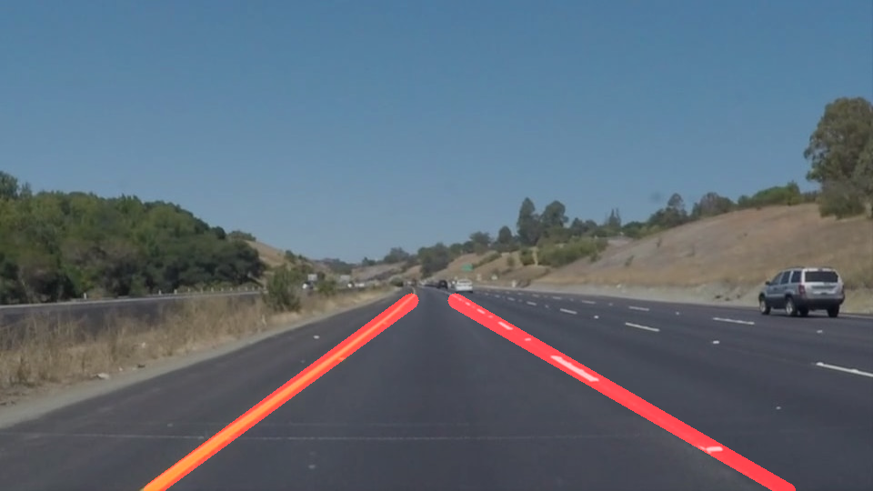

# **Finding Lane Lines on the Road** 

---

**Finding Lane Lines on the Road**

The goals / steps of this project are the following:
* Make a pipeline that finds lane lines on the road
* Reflect on your work in a written report

[//]: # (Image References)

[image1]: ./examples/grayscale.jpg "Grayscale"

[image2]: ./test_images_output/gray_solidYellowCurve.jpg  "Gray"

[image3]: ./test_images_output/smooth_solidYellowCurve.jpg "Blur"

[image4]: ./test_images_output/canny_solidYellowCurve.jpg "Canny"

[image5]: ./test_images_output/mask_solidYellowCurve.jpg "Mask"

[image6]: ./test_images_output/hough_solidYellowCurve.jpg "Hough"

[image7]: ./test_images_output/disp_solidYellowCurve.jpg "Disp"

[image8]: ./test_images/solidYellowCurve.jpg "Origin"

---

### Reflection

### 1. Describe your pipeline. As part of the description, explain how you modified the draw_lines() function.

My pipeline consisted of 5 steps. 

1. Converted the images frmo RGB to grayscale, using the defined grayscale in openCV. 

2. Applied gaussian smoothing on the grayscale image, changing the kernal size parameter will change the blurry of the image. Larger kernal size will help eliminate distractions from the small patterns on the ground, but with the risk of losing disconnected short lane lines.

3. Canny edge detection. In this case of simply doing lane detection, larger thresholds (for both low and high) will help reduce the disturbance, but same concerns for the dotted lane lines.

4. Masking the region of interest. For different camera position, there should be different scale of region been chosen. A quadrilateral generally works fine for this case, it will be better to define the region by the relative scale against the image size.

5. Hough transform for line marking. Change of Hough transform parameters can significantly affect the final output. In order to draw a single line on the left and right lanes, I modified the draw_lines() function by 
    - calculated every slope of lines, line points contribute to a negative slope go to the 'left' group and rest to the 'right',
    - lines with slopes below a certain threshold (0.3) here, are filtered,
    - applied least square linear regression on both 'left' and 'right' group on points for the final left and right lane lines.

6. Combining the lane line marks with original image in a weighted way.

    
    
    
    
    
    
    

### 2. Identify potential shortcomings with your current pipeline

The pipeline works well when the images are taken from the same camera setting, especially regarding to the angle to lok at the road.
Along with that, road condition (e.p. change of road color), faded lane painting, traffic in the neighbor lanes, 
shadows and dumps on the ground all has significant effect to the result.

Shortcomings showed when:
- Camera angle changed as in the challenge video, which requires reset the redion of interest by hand. 
Similarly with resolution, videos with high resolution like in the challenge will require more blur on the scene.
This can be avoid by having standard settings for camera location and frames taken. 

- Sudden change of road condition. In the challenge video, there are moments the dark road surface changed to lighter road surface,
which caused huge mess in the line detection. In this case, the obvious contract between road surfaces added difficulty to Canny edge detection.
A possible way to solve this is when lane line changed in an absurd scale, smoothing between video frames will be applied. 

- Lane line in poor conditions. When the lane lines appear in discrete form, especially with short dotted marks, 
in most cases those marks will not be discovered by the Hough transform algorithm. Sometimes, changing the parameters to make the lane clearer
will at the same time create a lot interference. It would be better to have a adaptive system for tuning those parameters.

### 3. Suggest possible improvements to your pipeline

A possible improvement would be to increase the contrast of the image to make the lane lines become more obvious. 
This can be done by controling the averaging ratio between three color channels when converting an image into grayscale. 

Another potential improvement could be to upgrade the _draw_lines()_ function. The current method of getting extrapolate lane lines from
linear regression will biased terribly when there are few useful line points with many more false line points. One way to narrow 
the scale is to limit line slopes in a reasonable range. Another is to draw a pair of new lines based on a few past lines, in this case,
finding the proper intersect value is crucial. One more concern about making rules too strick for line slection is end up with no 
eligible candidate lines that will terminate the whole transforming pipeline.
